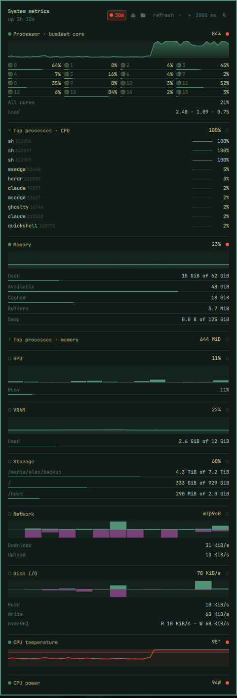

# System Metrics

A bar widget for the [Omarchy](https://omarchy.org/) shell: a strip of live
system gauges, and a popup with the detail behind them.

Readings come straight from `/proc` and `/sys` — there is no monitoring daemon
to install, and nothing to configure to get started.


## It costs almost nothing to run

A system monitor that measures load should not be a meaningful source of it.
Out of the box this one samples CPU and memory every two seconds, and that
whole cycle is **two file reads and about 13µs of parsing** — roughly a
thousandth of a percent of one core.

That number comes from what the widget does *not* do:

- **No subprocesses on the recurring path.** `/proc` and `/sys` are read
  directly through the shell's own file API. Shelling out to `awk`, `ps`, or
  `sensors` on a timer means forking an interpreter every tick, which costs
  milliseconds of real CPU — hundreds of times more than reading the same
  file, and it recurs forever. The one exception is filesystem capacity,
  which comes from `statfs` and which `/proc` genuinely cannot provide: that
  is a single `sh -c "df … | head -c 65536"` pipeline, run every fifteenth
  tick and only while Storage is actually being shown. Nothing else forks.
- **Nothing is sampled unless it is being looked at.** With the popup shut,
  only the metrics you pinned to the bar cost anything; the rest are idle. Open
  the popup and everything samples, because every section needs live data.
  Close it and they stop.
- **Each gauge repaints on its own samples.** A CPU sample redraws the CPU
  gauge, not the network one. That sounds obvious, but the naive version — one
  "something changed" counter — makes N gauges repaint N times per tick, and a
  canvas repaint is far more expensive than the sample that triggered it.
- **Readings are bounded.** Mount tables and interface lists are inputs whose
  size someone else controls, so every recurring reader has a byte, row, and
  name-length ceiling, and discards input that overruns it rather than parsing
  a torn row. A hostile `/proc` cannot turn the widget into a memory leak
  inside your shell.

The last two matter more than they look: this runs inside the *shared*
Quickshell process that draws your whole desktop. Anything wasteful here is not
a widget misbehaving, it is your bar stuttering.

None of this is asserted on faith — the numbers above are measured, and the
bounds and gating are covered by the test suite (`tests/run`), including a
smoke test that runs the real widget inside a real `quickshell`.

## What it shows

Nine metrics, each of which you choose to show on the bar or keep in the popup:

| Metric | On the bar | In the popup |
|---|---|---|
| CPU | busiest core | per-core grid, all-core average, load average |
| CPU temperature | banded line | sensor reading with threshold |
| Memory | used %, swap as a second line | used / available / cached / buffers / swap |
| GPU | busy % | busy meter |
| VRAM | used % | used of total |
| GPU temperature | banded line | die reading |
| Storage | fullest filesystem | every filesystem, used of total |
| Network | download and upload | per-direction rates, interface |
| Disk I/O | read and write | per-device read and write rates |

The CPU gauge plots the **busiest core**, not the average across all of them.
The kernel's aggregate averages every core, which hides the load people
usually want to see: on a 16-core machine one core pegged at 93% reads as 7%
aggregate, so a compile barely moves the graph. `cpu.urgent` is compared
against the same number. The all-core average is still shown, in the popup.

Clicking the strip opens the detail view, which is also where you choose what
the bar shows:



## Install

```bash
omarchy plugin add https://github.com/alextakitani/omarchy-sysmetrics.git --enable
```

That is the whole installation: the widget places itself on the right of the
bar and starts with CPU and memory. Everything else is optional — you can add
or remove metrics by clicking their headings in the popup, and never touch a
config file.

To place it somewhere else:

```bash
omarchy plugin enable takitani.sysmetrics --section center      # or: --before omarchy.clock
```

### Removing it

```bash
omarchy plugin remove takitani.sysmetrics
```

That takes the widget off the bar and deletes the plugin. To keep it installed
but hide it, `omarchy plugin disable takitani.sysmetrics` instead.

## Using it

- **Click** the strip to open the popup.
- **Click a section heading** in the popup to add or remove that metric from
  the bar. A filled dot means it is on the bar, a hollow one means it lives
  only in the popup.
- **Pin** (top right of the popup) keeps the popup open instead of dismissing
  it on the next click elsewhere.
- **refresh − +** adjusts the poll interval, from 500ms to 15s.
- **Middle-click** the strip forces an immediate sample.

Every section is present in the popup whether or not its metric is on the bar,
so a metric you have hidden is still reachable to bring back.

## Configuration

The popup covers the common cases (which metrics show, how often they refresh),
so this is only needed for the settings it does not expose. Add the keys you
want to the widget's entry in `~/.config/omarchy/shell.json`:

```jsonc
{
  "id": "takitani.sysmetrics",
  "metrics": ["cpu", "memory"],   // any subset, in any order
  "intervalMs": 2000,             // 500–60000 (the popup stepper goes to 15000)
  "historyLength": 60,            // samples kept per metric
  "sparklineWidth": 34,           // px per gauge plot, 12–200
  "showSparkline": true,          // false: values and icons only, no plots
  "showValue": true,
  "showIcon": true,
  "cpu":         { "urgent": 90 },   // compared against the busiest core
  "memory":      { "urgent": 90 },
  "gpu":         { "card": "auto", "urgent": 95 },
  "storage":     { "urgent": 90 },
  "network":     { "interface": "auto", "minCeiling": 65536 },
  "disk":        { "devices": "auto", "minCeiling": 1048576 },
  "cputemp":     { "sensor": "auto", "range": [30, 95], "urgent": 85 },
  "gputemp":     { "sensor": "auto", "range": [30, 95], "urgent": 85 }
}
```

`"auto"` resolves at runtime: the GPU by its DRM driver, temperature sensors by
their hwmon name, the network interface by the default route, and disks by
excluding partitions and virtual devices. None of these are addressable by a
fixed path — DRM card numbers and hwmon indices are not stable across reboots.

`showIcon`, `showSparkline` and `showValue` are independent, so the strip can
be reduced to whichever parts you want — `"showSparkline": false` leaves a row
of plain readouts with no plots. Turning all three off leaves each gauge with
nothing to draw, so the widget falls back to the same placeholder glyph it
shows when no metric is pinned: still there, still clickable, still a way back
to the popup. The popup keeps its charts either way.

Unknown keys are ignored and malformed values fall back to their defaults, so a
bad config degrades rather than breaking.

## Design notes

Two decisions are worth knowing about, because the code looks inconsistent
without them:

**Each metric is drawn in the form that suits it.** A filled area implies a
zero baseline, so temperatures — which live between about 30°C and 95°C — are
drawn as an unfilled line across that band. Plotted from 0°C the entire
idle-to-throttle range would occupy a couple of pixels. Network and disk are
mirrored columns because collapsing two directions into one line discards half
the information. GPU busy time is columns because a line interpolates activity
between two idle samples that never happened.

**Label widths are fixed by contract.** Each label sits in a box sized by
measuring a template string in the theme's own font, so the strip does not
shuffle as values change — which would move click targets under the cursor. The
templates come from the format contract, never from observed values.

Everything is themed through the shell's own colour tokens, so the widget
follows whatever theme is active, including live theme switches.

[docs/CONTRACT.md](docs/CONTRACT.md) records the reasoning in full, along with
the failure modes found while building it.

## Requirements

Omarchy with the Quickshell-based shell and bar widget plugin support.
`df` (coreutils) for the Storage metric; everything else is `/proc` and `/sys`.

## License

MIT
