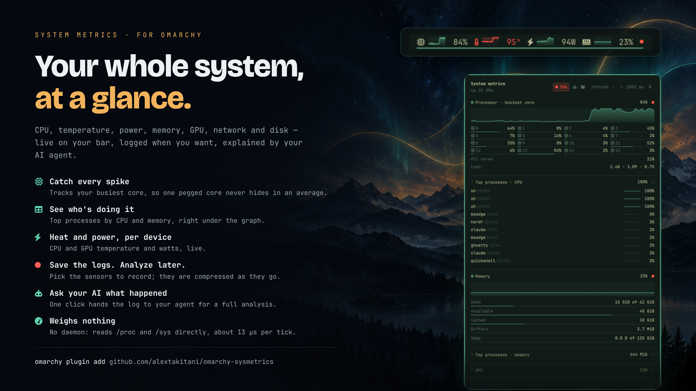

# System Metrics

**English** · [Português (Brasil)](README.pt-BR.md)



A bar widget for the [Omarchy](https://omarchy.org/) shell: a strip of live
system gauges, and a popup with the detail behind them.

Readings come straight from `/proc` and `/sys` — there is no monitoring daemon
to install, and nothing to configure to get started.


## It costs almost nothing to run

A system monitor that measures load should not be a meaningful source of it.
Out of the box this one samples CPU and memory every two seconds, and that
whole cycle is **two file reads and about 13µs of parsing** — roughly a
thousandth of a percent of one core.

That number comes from what the widget does *not* do:

- **No subprocesses on the recurring path.** `/proc` and `/sys` are read
  directly through the shell's own file API. Shelling out to `awk`, `ps`, or
  `sensors` on a timer means forking an interpreter every tick, which costs
  milliseconds of real CPU — hundreds of times more than reading the same
  file, and it recurs forever. Two readings genuinely cannot be had that way,
  and both are fenced off. Filesystem capacity comes from `statfs`, which
  `/proc` does not carry: a single `sh -c "df … | head -c 65536"` pipeline,
  every fifteenth tick, only while Storage is being shown. The process lists
  need one `/proc/<pid>/stat` per process, which the shell's file API cannot
  glob: one `awk` sweep, and only while a list is actually expanded — a popup
  merely being open pays nothing. Nothing else forks.
- **Nothing is sampled unless it is being looked at.** With the popup shut,
  only the metrics you pinned to the bar cost anything; the rest are idle. Open
  the popup and the gauges all sample, because every section needs live data.
  Close it and they stop. The two process lists are gated one step finer
  still: they sample only while their own section is expanded, so a popup that
  is merely open never pays for a sweep.
- **Each gauge repaints on its own samples.** A CPU sample redraws the CPU
  gauge, not the network one. That sounds obvious, but the naive version — one
  "something changed" counter — makes N gauges repaint N times per tick, and a
  canvas repaint is far more expensive than the sample that triggered it.
- **Readings are bounded.** Mount tables and interface lists are inputs whose
  size someone else controls, so every recurring reader has a byte, row, and
  name-length ceiling, and discards input that overruns it rather than parsing
  a torn row. A hostile `/proc` cannot turn the widget into a memory leak
  inside your shell.

The last two matter more than they look: this runs inside the *shared*
Quickshell process that draws your whole desktop. Anything wasteful here is not
a widget misbehaving, it is your bar stuttering.

None of this is asserted on faith — the numbers above are measured, and the
bounds and gating are covered by the test suite (`tests/run`), including a
smoke test that runs the real widget inside a real `quickshell`.

## What it shows

Eleven metrics, each of which you choose to show on the bar or keep in the popup:

| Metric | On the bar | In the popup |
|---|---|---|
| CPU | busiest core | per-core grid, all-core average, load average |
| CPU temperature | banded line | sensor reading with threshold |
| Memory | used %, swap as a second line | used / available / cached / buffers / swap |
| GPU | busy % | busy meter |
| VRAM | used % | used of total |
| GPU temperature | banded line | die reading |
| Storage | fullest filesystem | every filesystem, used of total |
| Network | download and upload | per-direction rates, interface |
| Disk I/O | read and write | per-device read and write rates |
| CPU power | package watts | watts over time |
| GPU power | board watts | watts over time |

The CPU gauge plots the **busiest core**, not the average across all of them.
The kernel's aggregate averages every core, which hides the load people
usually want to see: on a 16-core machine one core pegged at 93% reads as 7%
aggregate, so a compile barely moves the graph. `cpu.urgent` is compared
against the same number. The all-core average is still shown, in the popup.

### Which process is doing it

The gauges say the machine is busy; two lists in the popup say what is making
it busy. **Top processes · CPU** sits directly under the CPU charts, and
**Top processes · memory** under the memory meters — each one breaking down
the reading above it. Both are collapsed until you click their heading.

They are the only sections that cannot be pinned to the bar (ten rows of
process names do not belong on a strip), so their headings carry a disclosure
caret instead of a pin dot. Each row is a process name, its pid, and the
reading it is ranked by.

The CPU column is what each process used *since the previous sweep*, not the
lifetime average `ps` prints as `%CPU`. They answer different questions: a
process that ran hot for an hour and has since gone idle tops the lifetime
list forever, which is exactly the row nobody wants there. It is a percentage
of one core, so a threaded process passes 100% — the same reading `top` gives.
Expect a dash on the first tick after expanding: with only one sweep there is
no interval to measure against, and inventing a number there would be a lie.

The memory column is RSS, which double-counts pages shared between processes,
so the rows do not sum to the machine's used memory; they answer which process
is holding the most.

Clicking the strip opens the detail view, which is also where you choose what
the bar shows:


## Install

```bash
omarchy plugin add https://github.com/alextakitani/omarchy-sysmetrics.git --enable
```

That is the whole installation: the widget places itself on the right of the
bar and starts with CPU and memory. Everything else is optional — you can add
or remove metrics by clicking their headings in the popup, and never touch a
config file.

To place it somewhere else:

```bash
omarchy plugin enable takitani.sysmetrics --section center      # or: --before omarchy.clock
```

### Removing it

```bash
omarchy plugin remove takitani.sysmetrics
```

That takes the widget off the bar and deletes the plugin. To keep it installed
but hide it, `omarchy plugin disable takitani.sysmetrics` instead.

## Using it

- **Click** the strip to open the popup.
- **Click a section heading** in the popup to add or remove that metric from
  the bar. A filled dot means it is on the bar, a hollow one means it lives
  only in the popup.
- **Pin** (top right of the popup) keeps the popup open instead of dismissing
  it on the next click elsewhere.
- **refresh − +** adjusts the poll interval, from 500ms to 15s.
- **Middle-click** the strip forces an immediate sample.

Every section is present in the popup whether or not its metric is on the bar,
so a metric you have hidden is still reachable to bring back.

### Power

Two metrics, one per device, so each is pinned, plotted and logged on its own:
**CPU power** is the package, from RAPL's energy counter, and **GPU power** is
the card, from its driver's power sensor (`power1_average` on amdgpu). The
rest of the board, the drives and the fans are not metered, so the two
together are less than the draw at the wall.

The GPU reading works out of the box. **The CPU package does not**: the kernel
makes RAPL's `energy_uj` readable by root only, and the popup says so until
you grant access. It is locked down because fine-grained energy readings can
leak information about what other processes are computing (the PLATYPUS
attack), which matters on a shared machine and far less on a single-user
desktop. If that trade-off is fine for you, a udev rule opens it for reading:

```bash
echo 'ACTION=="add", SUBSYSTEM=="powercap", KERNEL=="intel-rapl:*", RUN+="/usr/bin/chmod 0444 /sys%p/energy_uj"' \
  | sudo tee /etc/udev/rules.d/60-rapl-energy-read.rules
sudo udevadm trigger --subsystem-match=powercap --action=add   # apply now, no reboot
```

The widget retries the read every tick, so CPU power appears within a couple
of seconds, with no shell restart. To undo it, delete the rule and reboot.

What the CPU figure covers: the RAPL *package* domain (`intel-rapl:0`), which
is the whole processor — every core plus the shared parts of the chip (L3,
memory controller, interconnect). Not the motherboard or its voltage
regulators.

**On AMD too, despite the name.** RAPL is an interface Intel introduced and
AMD implements from Zen onward; the kernel serves both through its
`intel_rapl` driver, so AMD CPUs show up as `intel-rapl` as well. On AMD the
reading comes from the chip's own power model rather than a measurement on
the supply rails, so it is good for trends and peaks, not metering-grade.

## Recording

The popup can log readings to disk for later analysis — a day's CPU and
temperature, and which processes were behind them.

- The **red marker** at the right of each section heading chooses whether that
  reading is logged, independently of whether it is on the bar. The two
  process lists share one marker. Until you touch them, a recording logs
  whatever is pinned.
- **rec** (top of the popup) starts and stops a recording. While one runs it
  shows its duration, and the strip carries a red dot, because a recording
  keeps its metrics sampled with the popup shut.
- A recording survives a shell restart: it resumes into a new pair of files.
- The **folder** button beside **rec** opens the folder the recordings are
  written to.
- Once there is a recording, a **robot** button hands it to your default
  agent (`omarchy agent prompt`), started in the logs folder with a prompt
  that explains the files and asks for averages, peaks, the processes behind
  them and the energy used. A running recording is flushed first, so the
  agent sees everything up to the click.

Files go to `$XDG_STATE_HOME/omarchy-sysmetrics/logs/` (normally
`~/.local/state/…`), named by start time:

- `<stamp>-metrics.csv.zst` — one row per sampling tick: `t_ms` (unix ms)
  plus the chosen columns (`cpu_max_pct`, `cpu_avg_pct`, `cputemp_c`,
  `mem_pct`, `swap_pct`, `gpu_pct`, `vram_pct`, `gputemp_c`, `net_rx_Bps`,
  `net_tx_Bps`, `disk_read_Bps`, `disk_write_Bps`, `storage_pct`, `cpu_w`,
  `gpu_w`). A missing
  reading is an empty field, not 0.
- `<stamp>-processes.csv.zst` — every 30 seconds, the five processes that used
  the most CPU and the five holding the most memory in that window:
  `t_ms,pid,comm,cpu_s,rss_bytes`. `cpu_s` is CPU time spent *in that window*,
  so summing it gives each process's total.

Each file is written by one long-lived writer fed over a pipe, so a tick costs
one line written to a pipe — no file reopened. Once a minute the rows so far
are sealed into a zstd frame, appended to the file and fsynced, so a crash of
the whole machine loses at most the last minute. At the default interval that
is under 1 MB a day. Stopping the recording, or restarting the shell, flushes
everything. Apart from that per-minute `zstd`, the process sweep is the only
fork, once per window.

Reading it back, for example with DuckDB:

```sql
-- temperature over the day
SELECT avg(cputemp_c), max(cputemp_c), quantile_cont(cputemp_c, 0.95)
FROM 'logs/*-metrics.csv.zst';

-- who burned the CPU
SELECT comm, round(sum(cpu_s) / 60, 1) AS cpu_minutes
FROM 'logs/*-processes.csv.zst' GROUP BY comm ORDER BY 2 DESC LIMIT 10;
```

## Configuration

The popup covers the common cases (which metrics show, how often they refresh),
so this is only needed for the settings it does not expose. Add the keys you
want to the widget's entry in `~/.config/omarchy/shell.json`:

```jsonc
{
  "id": "takitani.sysmetrics",
  "metrics": ["cpu", "memory"],   // any subset, in any order
  "logMetrics": ["cpu", "cputemp", "processes"],  // what a recording logs
  "recording": false,             // the rec button; persisted across restarts
  "intervalMs": 2000,             // 500–60000 (the popup stepper goes to 15000)
  "historyLength": 60,            // samples kept per metric
  "sparklineWidth": 34,           // px per gauge plot, 12–200
  "showSparkline": true,          // false: values and icons only, no plots
  "showValue": true,
  "showIcon": true,
  "cpu":         { "urgent": 90 },   // compared against the busiest core
  "memory":      { "urgent": 90 },
  "gpu":         { "card": "auto", "urgent": 95 },
  "storage":     { "urgent": 90 },
  "network":     { "interface": "auto", "minCeiling": 65536 },
  "disk":        { "devices": "auto", "minCeiling": 1048576 },
  "cputemp":     { "sensor": "auto", "range": [30, 95], "urgent": 85 },
  "gputemp":     { "sensor": "auto", "range": [30, 95], "urgent": 85 }
}
```

`"auto"` resolves at runtime: the GPU by its DRM driver, temperature sensors by
their hwmon name, the network interface by the default route, and disks by
excluding partitions and virtual devices. None of these are addressable by a
fixed path — DRM card numbers and hwmon indices are not stable across reboots.

`showIcon`, `showSparkline` and `showValue` are independent, so the strip can
be reduced to whichever parts you want — `"showSparkline": false` leaves a row
of plain readouts with no plots. Turning all three off leaves each gauge with
nothing to draw, so the widget falls back to the same placeholder glyph it
shows when no metric is pinned: still there, still clickable, still a way back
to the popup. A vertical bar has no strip to lay out in the first place, so it
keeps showing its single-value label. The popup keeps its charts either way.

Unknown keys are ignored and malformed values fall back to their defaults, so a
bad config degrades rather than breaking.

## Design notes

Two decisions are worth knowing about, because the code looks inconsistent
without them:

**Each metric is drawn in the form that suits it.** A filled area implies a
zero baseline, so temperatures — which live between about 30°C and 95°C — are
drawn as an unfilled line across that band. Plotted from 0°C the entire
idle-to-throttle range would occupy a couple of pixels. Network and disk are
mirrored columns because collapsing two directions into one line discards half
the information. GPU busy time is columns because a line interpolates activity
between two idle samples that never happened.

**Label widths are fixed by contract.** Each label sits in a box sized by
measuring a template string in the theme's own font, so the strip does not
shuffle as values change — which would move click targets under the cursor. The
templates come from the format contract, never from observed values.

Everything is themed through the shell's own colour tokens, so the widget
follows whatever theme is active, including live theme switches.

[docs/CONTRACT.md](docs/CONTRACT.md) records the reasoning in full, along with
the failure modes found while building it.

## Requirements

Omarchy with the Quickshell-based shell and bar widget plugin support.
`df` (coreutils) for the Storage metric; everything else is `/proc` and `/sys`.

## Changes

[CHANGELOG.md](CHANGELOG.md) records what changed in each release.

## License

MIT
